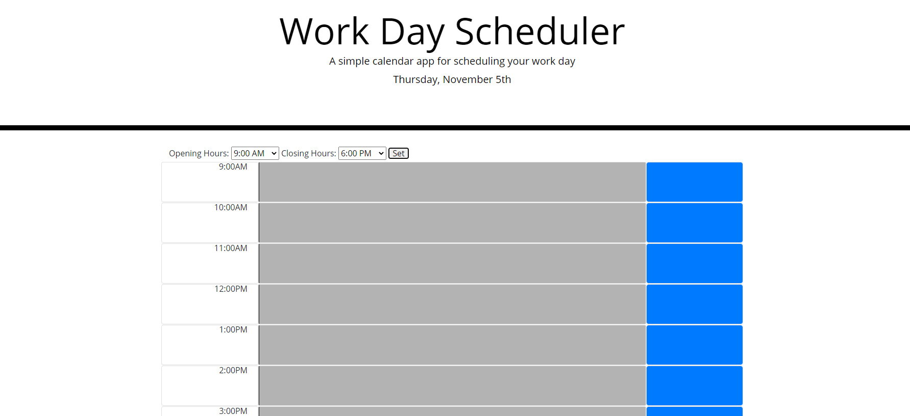
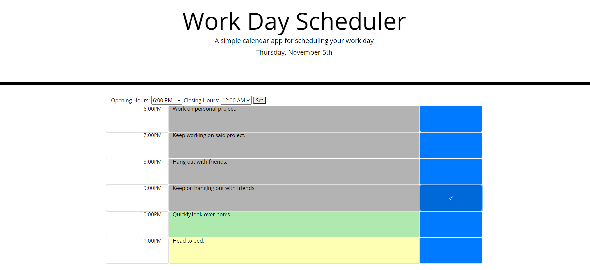

# Day-Planner
A very basic day planner where you can set up what you plan to do for that day.
By default, opening hours are set to 9AM and end at 6PM.

The color of each timeblock is determined by the time of day. Grey block are in the past, green blocks are the present and yellow blocks are the future. You can click the colored blocks and type what you plan to do for that hour. After you're done, you'll need to click the blue button on the right to save the event for that hour. You'll be shown a little check mark saying that it saved successfully. Everything you saved will be shown again to you after you visit the page again.
